# TarkovTracker Dependency & Integration Point Analysis

**Generated:** 2025-10-14
**Project:** TarkovTracker (Vue 3 + Firebase Cloud Functions Monorepo)
**Purpose:** Comprehensive dependency mapping and integration point analysis for legacy modernization

---

## Executive Summary

This document provides a detailed analysis of internal dependencies, external integrations, and coupling patterns within the TarkovTracker application. The analysis identifies critical integration points that require facade/adapter patterns during modernization and highlights circular dependencies that need resolution.

**Key Findings:**

- **High Coupling Areas:** Progress store ↔ Tarkov data composables, shared_state.ts across frontend/backend
- **Critical Integration Points:** Firestore schema, Tarkov.dev GraphQL API, Firebase services
- **Circular Dependencies:** Task availability service references multiple stores, global tarkovdata state pattern
- **Migration Risk:** Dual handler implementations (legacy + modern), direct Firestore access patterns

---

## 1. Internal Module Dependencies

### 1.1 Frontend Component Dependency Graph

```mermaid
graph TB
    subgraph "Pages (Route Level)"
        TaskList[TaskList.vue]
        HideoutList[HideoutList.vue]
        NeededItems[NeededItems.vue]
        Dashboard[TrackerDashboard.vue]
        Settings[TrackerSettings.vue]
    end

    subgraph "Feature Components"
        TaskCard[TaskCard.vue]
        TaskInfo[TaskInfo.vue]
        TaskObjective[TaskObjective.vue]
        TaskActions[TaskActions.vue]
        HideoutCard[HideoutCard.vue]
        NeededItemRow[NeededItemRow.vue]
        TeammemberCard[TeammemberCard.vue]
        ApiTokens[ApiTokens.vue]
    end

    subgraph "Composables"
        useTaskList[useTaskList.ts]
        useTaskFiltering[useTaskFiltering.ts]
        useTaskData[useTaskData.ts]
        useHideoutData[useHideoutData.ts]
        useMapData[useMapData.ts]
        tarkovdata[tarkovdata.ts]
        useProgressQueries[useProgressQueries.ts]
    end

    subgraph "Stores (Pinia)"
        tarkovStore[tarkov.ts]
        progressStore[progress.ts]
        userStore[user.ts]
        teamStore[useTeamStore.ts]
        appStore[app.ts]
    end

    subgraph "Shared State"
        shared_state[shared_state.ts]
    end

    TaskList --> TaskCard
    TaskList --> useTaskList
    TaskCard --> TaskInfo
    TaskCard --> TaskObjective
    TaskCard --> TaskActions
    HideoutList --> HideoutCard
    NeededItems --> NeededItemRow
    Dashboard --> TeammemberCard
    Settings --> ApiTokens

    useTaskList --> useTaskFiltering
    useTaskList --> useTaskData
    useTaskData --> tarkovdata
    useHideoutData --> tarkovdata
    useMapData --> tarkovdata

    TaskCard --> progressStore
    TaskCard --> tarkovStore
    HideoutCard --> progressStore
    NeededItemRow --> progressStore

    progressStore --> tarkovStore
    progressStore --> userStore
    progressStore --> teamStore

    tarkovStore --> shared_state
    progressStore --> shared_state

    useProgressQueries --> progressStore

    style tarkovdata fill:#ff9999
    style progressStore fill:#ff9999
    style shared_state fill:#ffcc99
```

**Coupling Hotspots:**

1. **tarkovdata.ts** - Global state pattern with late initialization (HIGH RISK)
2. **progress.ts** - Depends on tarkov.ts, user.ts, teamStore.ts (MEDIUM RISK)
3. **shared_state.ts** - Shared between frontend and backend (HIGH RISK)

---

### 1.2 Composable Dependencies

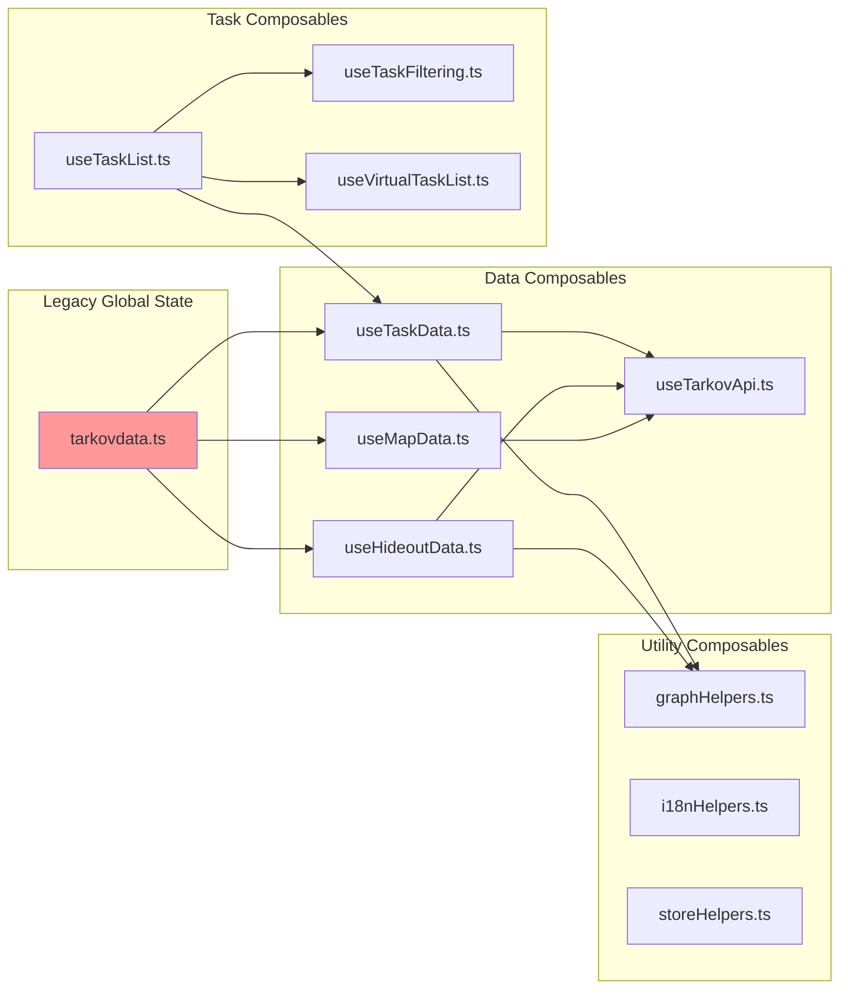

**Key Observations:**

- **tarkovdata.ts** acts as a backward compatibility layer wrapping modular composables
- **Global refs** (hideoutStations, tasks, taskGraph) created at module level cause late initialization issues
- **Circular risk:** tarkovdata imports composables which may reference global state

---

### 1.3 Store Interdependencies (Pinia)

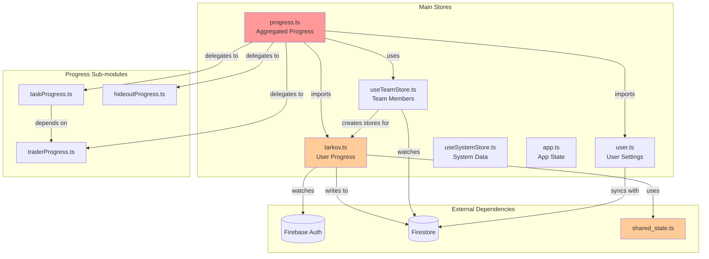

**Critical Dependencies:**

1. **progressStore → tarkovStore** (line 4, 49 in progress.ts)
2. **progressStore → teamStore** (line 6, 45 in progress.ts)
3. **taskProgress → traderProgress** (line 71-74 in progress.ts - tight coupling for requirements)
4. **tarkovStore → shared_state** (lines 7-13 in tarkov.ts - actions, getters, defaultState)

**Coupling Analysis:**

- **Data Flow:** tarkovStore (individual) → progressStore (aggregated) → UI components
- **State Dependency:** taskProgress requires traderProgress data for task availability calculations
- **Real-time Sync:** tarkovStore uses VueFire's fireswap for automatic Firestore binding

---

### 1.4 Backend Service Layer Dependencies

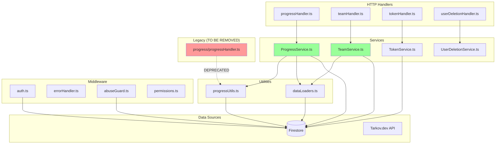

**Service Layer Pattern:**

- **Handler → Service → Utils** (clean separation achieved in modern code)
- **Legacy Handler** (696 LOC) still exists alongside modern implementation (HIGH PRIORITY REMOVAL)
- **Data Loaders** provide caching layer for Firestore reads (tasks, hideout data)

**Observations:**

- ✅ Good: Service classes instantiated per-request (lightweight)
- ⚠️ Medium: No singleton pattern (creates new service instances)
- ❌ Bad: Dual handler implementations increase maintenance burden

---

## 2. External Service Integrations

### 2.1 Firebase Services Integration Map

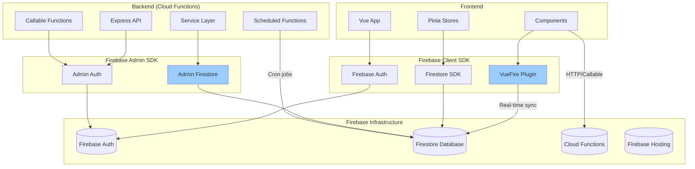

**Integration Points:**

| Integration | Type | Usage | Risk Level |
|-------------|------|-------|----------|
| **Firebase Auth** | Authentication | User login, token verification | LOW |
| **Firestore (Frontend)** | Real-time DB | Progress sync via VueFire | MEDIUM |
| **Firestore (Backend)** | Database | Transaction-based writes | LOW |
| **Cloud Functions** | Serverless | API endpoints, scheduled jobs | LOW |
| **Firebase Hosting** | Static hosting | Frontend deployment | LOW |

**Authentication Flow:**

```mermaid
User → Firebase Auth SDK → Firebase Auth Service → ID Token
  ↓
Frontend stores token → Sends with API requests
  ↓
Backend middleware → Verifies token via Admin SDK → User context
```

---

### 2.2 Tarkov.dev GraphQL API Integration

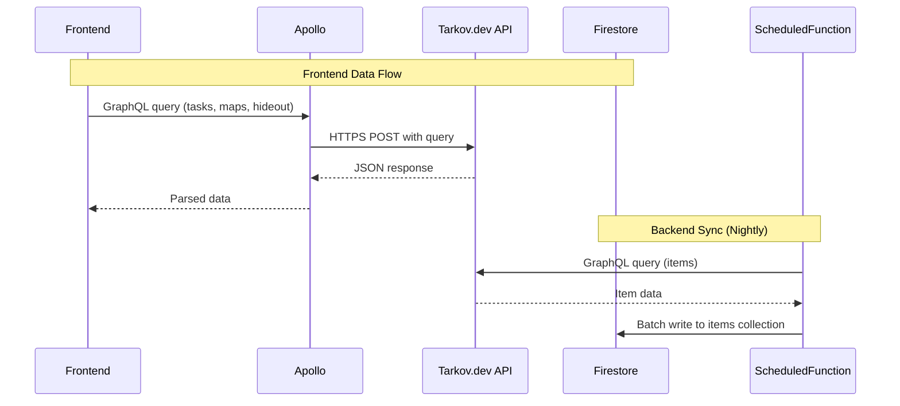

**API Contract:**

```typescript
// Frontend: useTarkovDataQuery
query TarkovData($gameMode: String) {
  tasks(gameMode: $gameMode) {
    id
    name
    trader { id, name, imageLink }
    objectives { id, type, count, foundInRaid, maps { id } }
    taskRequirements { task { id }, status }
    traderRequirements { trader { id }, value }
    // ... 662 lines total
  }
}

// Backend: scheduledTarkovDataFetch (items only)
query TarkovItems {
  items {
    id, name, shortName, basePrice
    traderPrices { price, trader { name } }
    // ... full item schema
  }
}
```

**Critical Issues:**

1. **No versioning** - API schema changes break frontend immediately
2. **No caching** - Frontend queries on every page load
3. **Large query** - 662-line GraphQL query in tarkovdataquery.ts
4. **Dual sync** - Frontend uses Apollo, backend uses graphql-request

**Risk Assessment:** **HIGH**

- **Impact if API changes:** Complete application failure
- **Mitigation:** Implement Firestore caching with fallback (RECOMMENDED)

---

### 2.3 Third-Party Service Catalog

| Service | Purpose | Integration Point | Caching | Fallback |
|---------|---------|-------------------|---------|----------|
| **Tarkov.dev GraphQL** | Game data (tasks, maps, items) | Apollo Client (frontend), graphql-request (backend) | ❌ None | ❌ None |
| **Firebase Auth** | User authentication | Firebase SDK | ✅ SDK handles | ✅ SDK handles |
| **Firestore** | User progress, teams, tokens | VueFire (frontend), Admin SDK (backend) | ✅ Optimistic updates | ✅ Offline support |
| **Apollo Client v3** | GraphQL client | @apollo/client | ✅ InMemoryCache | ❌ No fallback |
| **Vuetify 3** | UI components | Vue plugin | N/A | N/A |
| **Vue I18n** | Internationalization | Vue plugin | ✅ Locale caching | ✅ Fallback locale |

**Upgrade Path:**

- **Apollo Client v3 → v4** (BREAKING CHANGE - see LEGACY_MODERNIZATION_REPORT.md)
- **Firebase SDK v11 → v12** (MINOR UPDATE)

---

## 3. Shared Database Schemas

### 3.1 Firestore Collections Structure

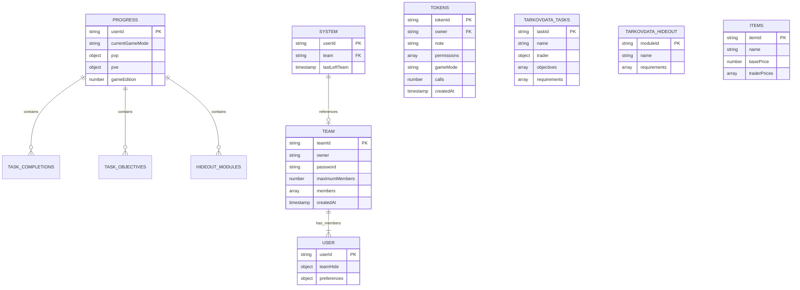

**Collection Access Patterns:**

| Collection | Frontend Access | Backend Access | Real-time Sync |
|------------|----------------|----------------|----------------|
| **progress/** | VueFire (read/write) | Admin SDK (read/write) | ✅ Yes |
| **system/** | VueFire (read) | Admin SDK (read/write) | ✅ Yes |
| **team/** | VueFire (read) | Admin SDK (read/write) | ✅ Yes |
| **user/** | Firestore SDK (read/write) | Admin SDK (read) | ❌ No |
| **tokens/** | ❌ Backend only | Admin SDK (read/write) | ❌ No |
| **tarkovdata/** | ❌ Backend only | Admin SDK (read) | ❌ No |
| **items/** | ❌ Backend only | Admin SDK (read/write) | ❌ No |

---

### 3.2 Progress Document Schema (Game Mode Aware)

```typescript
// Shared schema: shared_state.ts (frontend) & api.ts (backend)
interface UserProgressData {
  level: number;
  pmcFaction: 'USEC' | 'BEAR';
  displayName: string | null;
  taskObjectives: { [objectiveId: string]: TaskObjective };
  taskCompletions: { [taskId: string]: TaskCompletion };
  hideoutParts: { [objectiveId: string]: HideoutPart };
  hideoutModules: { [hideoutId: string]: HideoutModule };
  traderStandings: { [traderId: string]: TraderProgress };
}

interface UserState {
  currentGameMode: 'pvp' | 'pve';
  gameEdition: number;
  pvp: UserProgressData;
  pve: UserProgressData;
}

// Legacy format (backward compatibility)
interface LegacyProgressDocument {
  level: number;
  displayName: string;
  gameEdition: number;
  pmcFaction: string;
  taskCompletions: Record<string, TaskCompletion>;
  taskObjectives: Record<string, TaskObjective>;
  hideoutModules: Record<string, HideoutModule>;
  hideoutParts: Record<string, HideoutPart>;
}
```

**Migration Strategy:**

- **Frontend:** `migrateToGameModeStructure()` in shared_state.ts (line 71-147)
- **Backend:** `formatProgress()` in progressUtils.ts handles both formats
- **Real-time:** VueFire automatically syncs nested pvp/pve objects

**Schema Coupling Risk:** **HIGH**

- Changes require coordinated updates in 4 locations:
  1. Frontend shared_state.ts (types + migration)
  2. Backend api.ts (types)
  3. Backend progressUtils.ts (formatting)
  4. Firestore security rules (validation)

---

### 3.3 Real-time Listener Patterns (VueFire)

```typescript
// Pattern 1: Store-level binding (tarkov.ts)
export const useTarkovStore = defineStore('swapTarkov', {
  fireswap: [{
    path: '.',
    document: 'progress/{uid}',
    debouncems: 250,
    localKey: 'progress',
  }]
});

// Pattern 2: Progress store binding (progress.ts)
export const useProgressStore = defineStore('progress', {
  fireswap: [{
    path: '.',
    document: 'userProgress/{uid}',
    debouncems: 500,
    localKey: 'userProgress',
  }]
});

// Pattern 3: Team stores (useTeamStore.ts)
teammateStores[teammateId] = defineStore(`teammate-${teammateId}`, {
  fireswap: [{
    path: '.',
    document: 'progress/{teammateId}',
    debouncems: 500,
    localKey: `teammate-${teammateId}`,
  }]
});
```

**Binding Lifecycle:**

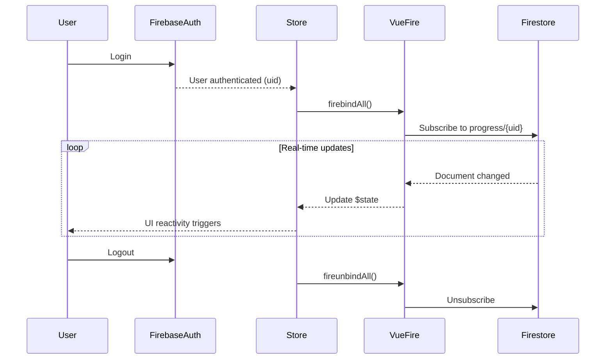

**Debounce Strategy:**

- **tarkov.ts**: 250ms (frequent updates expected)
- **progress.ts**: 500ms (aggregated data, less frequent)
- **Team stores**: 500ms (multiple listeners, reduce Firestore reads)

---

### 3.4 Transaction-based Operations

```typescript
// Example: Team creation with transaction safety
async createTeam(userId: string, data: CreateTeamData) {
  await this.db.runTransaction(async (transaction) => {
    // 1. Read: Check if user already in team
    const systemDoc = await transaction.get(systemRef);
    if (systemData?.team) {
      throw errors.conflict('User is already in a team');
    }

    // 2. Write: Create team document
    transaction.set(teamRef, {
      owner: userId,
      members: [userId],
      // ...
    });

    // 3. Write: Update user's system document
    transaction.set(systemRef, { team: createdTeamId }, { merge: true });
  });
}
```

**Transactional Operations:**

1. **createTeam** - Prevents race condition (user joins 2 teams simultaneously)
2. **joinTeam** - Validates team capacity atomically
3. **leaveTeam** - Handles owner leaving (disbands team) or member leaving
4. **updateSingleTask** - Ensures consistency of task state + dependencies
5. **updateMultipleTasks** - Batch updates in single transaction

**Transaction Safety Level:** **EXCELLENT** ✅

- All multi-document writes use transactions
- Proper error handling and rollback
- Prevents race conditions in team operations

---

## 4. Cross-System Data Flows

### 4.1 User Authentication Flow

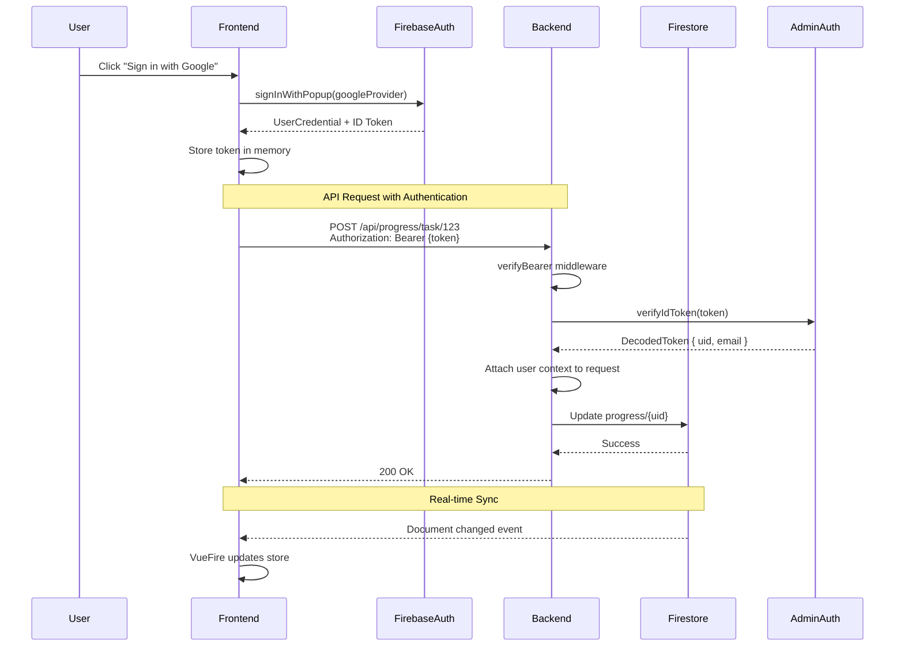

**Token Lifecycle:**

1. **Frontend:** Firebase SDK handles token refresh automatically
2. **Backend:** Middleware verifies token on every request
3. **API Tokens:** Custom bearer tokens stored in Firestore (tokens/ collection)

**API Token Flow:**

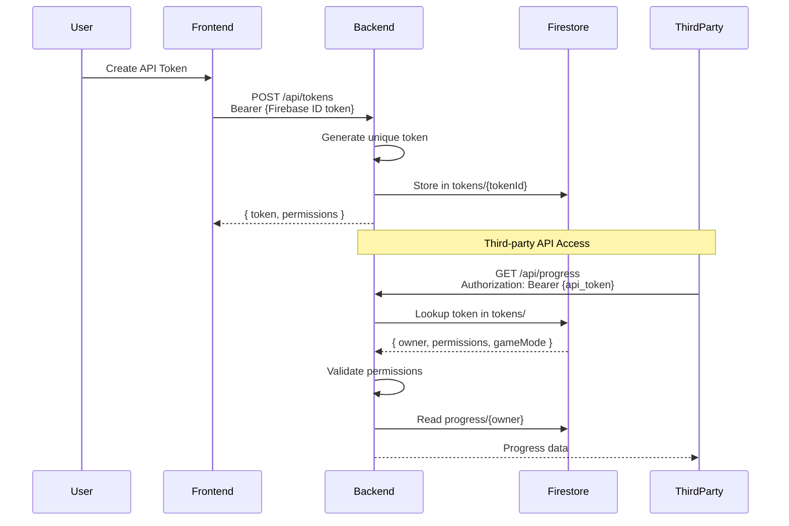

**Security Layers:**

1. **Firebase ID Token** - Short-lived (1 hour), auto-refreshed
2. **API Token** - Long-lived, manually revoked, permission-scoped
3. **Middleware:** verifyBearer → abuseGuard → requirePermission
4. **Firestore Rules:** Server-side validation of writes

---

### 4.2 Team Progress Synchronization

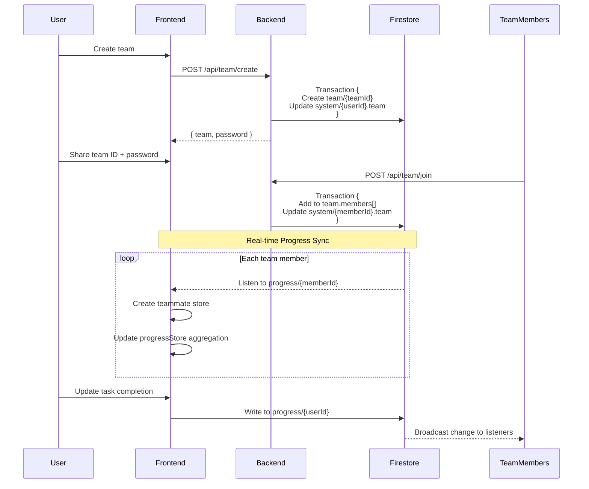

**Team Store Management:**

```typescript
// useTeamStore.ts - Creates dynamic stores for each team member
const teammateStores = ref<Record<string, Store>>({});

watch(teamMembers, (newMembers) => {
  newMembers.forEach(memberId => {
    if (!teammateStores.value[memberId]) {
      // Create new Pinia store with Firestore binding
      teammateStores.value[memberId] = defineStore(`teammate-${memberId}`, {
        fireswap: [{ document: `progress/${memberId}` }]
      })();
    }
  });
});
```

**Aggregation Pattern:**

```typescript
// progressStore.ts - Aggregates individual stores
const visibleTeamStores = computed(() => {
  const stores = { 'self': useTarkovStore() };
  Object.entries(teammateStores.value).forEach(([id, store]) => {
    if (!userStore.teamIsHidden(id)) {
      stores[id] = store;
    }
  });
  return stores;
});
```

**Data Flow:** Individual progress → Team stores → Aggregated computed → UI

---

### 4.3 Game Data Fetching & Caching

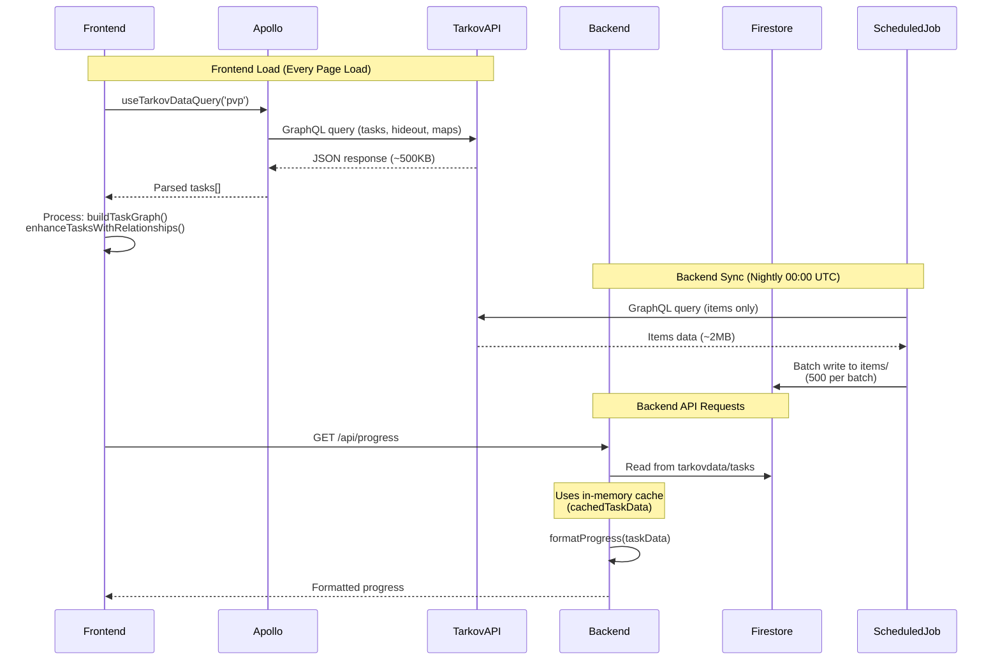

**Caching Strategy:**

| Layer | Cache Type | TTL | Invalidation |
|-------|-----------|-----|--------------|
| **Frontend (Apollo)** | InMemoryCache | Session | Page reload |
| **Backend (dataLoaders)** | Module-level variable | Function lifetime | Cold start |
| **Firestore (tarkovdata/)** | Persistent | Until updated | Manual/Scheduled |
| **Firestore (items/)** | Persistent | 24 hours | Scheduled job |

**Critical Issue:** **No distributed cache** (Redis/Memcached)

- **Impact:** Each Cloud Function instance caches independently
- **Recommendation:** Add Redis layer for shared caching (see LEGACY_MODERNIZATION_REPORT.md)

---

### 4.4 API Token Generation & Validation

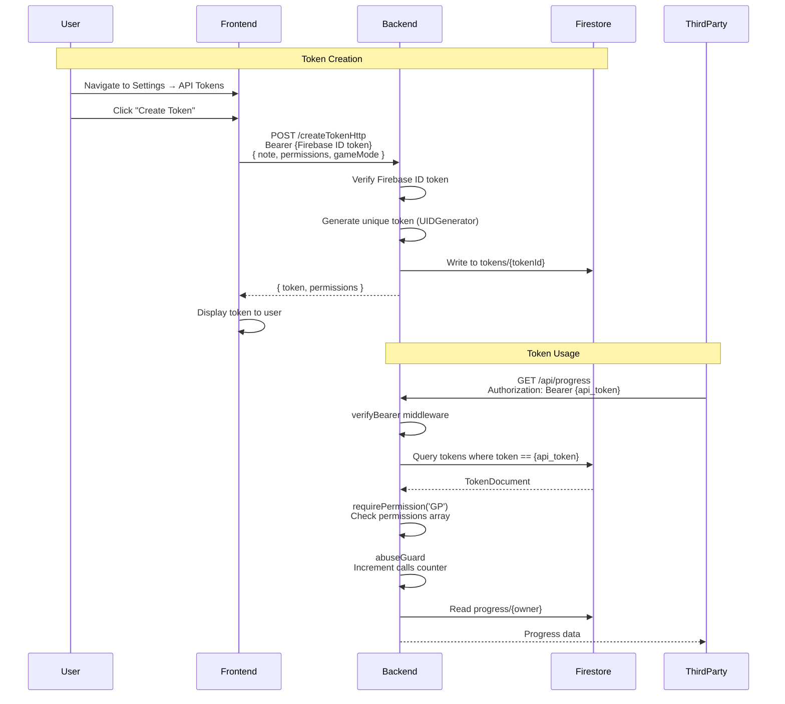

**Token Permissions:**

```typescript
const AVAILABLE_PERMISSIONS = [
  'GP', // Get Progress (read user progress)
  'WP', // Write Progress (update tasks/objectives)
  'TP', // Team Progress (read team progress)
];

// Token document structure
interface ApiToken {
  owner: string;           // User ID who owns this token
  note: string;            // User-provided description
  permissions: string[];   // ['GP', 'WP']
  gameMode?: 'pvp' | 'pve' | 'dual';  // Game mode restriction
  calls?: number;          // Usage counter
  createdAt: Timestamp;
  token: string;           // The actual bearer token
}
```

**Security Validations:**

1. **verifyBearer** - Checks if token exists (API token or Firebase token)
2. **requirePermission** - Validates permission scopes
3. **abuseGuard** - Rate limiting (increments calls counter)
4. **Game mode filtering** - Restricts data access based on token.gameMode

---

## 5. Integration Points Requiring Facade/Adapter Patterns

### 5.1 Legacy vs. Modern Handler Implementations

**Problem:** Dual implementations exist side-by-side

```typescript
// index.ts - BOTH imported and used
import { ... } from './progress/progressHandler.js';        // LEGACY (696 LOC)
const progressHandler = (await import('./handlers/progressHandler.js')).default; // MODERN (420 LOC)

// Routes use modern handlers
app.post('/api/progress/task/:taskId',
  requirePermission('WP'),
  progressHandler.updateSingleTask  // Uses ProgressService
);

// But legacy exports still exist
export {
  updateTask,          // Legacy function
  updateProgress,      // Legacy function
  getProgress          // Legacy function
} from './progress/progressHandler.js';
```

**Recommended Adapter Pattern:**

```typescript
// adapters/LegacyProgressAdapter.ts
export class LegacyProgressAdapter {
  private service: ProgressService;

  constructor() {
    this.service = new ProgressService();
  }

  // Adapter method matching legacy signature
  async updateTask(taskId: string, state: string, userId: string) {
    // Translate legacy call to modern service
    return await this.service.updateSingleTask(
      userId,
      taskId,
      state as TaskStatus,
      'pvp' // Default game mode
    );
  }

  // Deprecation warning
  logDeprecationWarning(method: string) {
    logger.warn(`Legacy method ${method} used. Please migrate to ProgressService.`);
  }
}
```

**Migration Steps:**

1. ✅ Create modern service layer (DONE)
2. ⚠️ Route all handlers through new services (IN PROGRESS)
3. ❌ Remove legacy progress/progressHandler.ts (TODO - HIGH PRIORITY)
4. ❌ Update any external callers to use new API (TODO)

---

### 5.2 Direct Firestore Access vs. Service Layer

**Problem:** Mixed access patterns

```typescript
// GOOD: Service layer (backend)
class ProgressService {
  async getUserProgress(userId: string) {
    const progressRef = this.db.collection('progress').doc(userId);
    // ... proper error handling, validation, formatting
  }
}

// CONCERNING: Direct access (frontend composables)
const progressRef = db.collection('progress').doc(userId);
await progressRef.update({ /* ... */ });

// GOOD: VueFire for reads
fireswap: [{
  document: 'progress/{uid}',
  debouncems: 500,
}]
```

**Recommended Facade Pattern:**

```typescript
// frontend/src/services/ProgressFacade.ts
export class ProgressFacade {
  /**
   * Facade for progress updates - delegates to backend API
   * Prevents direct Firestore writes from frontend
   */
  async updateTaskCompletion(taskId: string, state: TaskStatus) {
    // Use backend API instead of direct Firestore write
    return await apiClient.post(`/api/progress/task/${taskId}`, { state });
  }

  /**
   * Real-time progress reading - uses VueFire
   */
  useRealtimeProgress() {
    // VueFire handles this transparently through store binding
    return useTarkovStore();
  }
}
```

**Access Policy:**

- **Reads:** VueFire real-time binding (frontend) OR service layer (backend)
- **Writes:** Always through backend API (enforces validation + transactions)
- **Aggregations:** Always through backend (team progress, statistics)

---

### 5.3 Global State vs. Composable Patterns

**Problem:** tarkovdata.ts uses global state initialization

```typescript
// ANTI-PATTERN: Global mutable state
let globalTaskData: ReturnType<typeof useTaskData> | null = null;
export const tasks = ref<Task[]>([]);  // Empty until initialized

function initializeGlobalData() {
  if (!globalTaskData) {
    globalTaskData = useTaskData();  // First call initializes
  }
}

// Components must call useTarkovData() first
export function useTarkovData() {
  initializeGlobalData();  // Side effect!
  // Update global refs
  tasks.value = globalTaskData!.tasks.value;
  return { tasks, hideoutStations, /* ... */ };
}
```

**Recommended Pattern Migration:**

```typescript
// BETTER: Pinia store for shared data
// stores/tarkovData.ts
export const useTarkovDataStore = defineStore('tarkovData', () => {
  const { tasks, loading, error } = useTaskData();
  const { hideoutStations } = useHideoutData();

  // Computed aggregations
  const enabledTasks = computed(() =>
    tasks.value.filter(task => !DISABLED_TASKS.includes(task.id))
  );

  return {
    tasks,
    hideoutStations,
    enabledTasks,
    loading,
    error,
  };
});

// Components use store directly
const tarkovData = useTarkovDataStore();
```

**Migration Path:**

1. ✅ Create modular composables (DONE - useTaskData, useHideoutData, useMapData)
2. ⚠️ Maintain backward compatibility layer (CURRENT - tarkovdata.ts)
3. ❌ Migrate components to use stores directly (TODO)
4. ❌ Remove tarkovdata.ts global state pattern (TODO)

---

### 5.4 Database Schema Coupling

**Problem:** Schema changes require coordinated updates

```typescript
// Location 1: Frontend shared_state.ts
export interface UserProgressData {
  level: number;
  taskCompletions: { [taskId: string]: TaskCompletion };
  // ...
}

// Location 2: Backend api.ts
export interface UserProgressData {
  level?: number;
  taskCompletions?: Record<string, TaskCompletion>;
  // ...
}

// Location 3: Backend progressUtils.ts
function formatProgress(data: ProgressDocument) {
  return {
    playerLevel: data?.level ?? 1,
    tasksProgress: Object.entries(data?.taskCompletions || {}).map(/* ... */)
  };
}

// Location 4: Firestore security rules (firestore.rules)
match /progress/{userId} {
  allow write: if request.resource.data.level is number;
}
```

**Recommended Adapter Pattern:**

```typescript
// shared/schemas/ProgressSchema.ts (NEW - Monorepo package)
import { z } from 'zod';

export const TaskCompletionSchema = z.object({
  complete: z.boolean(),
  failed: z.boolean().optional(),
  timestamp: z.number().optional(),
});

export const UserProgressDataSchema = z.object({
  level: z.number().min(1).max(100),
  pmcFaction: z.enum(['USEC', 'BEAR']),
  displayName: z.string().nullable(),
  taskCompletions: z.record(TaskCompletionSchema),
  taskObjectives: z.record(z.object({
    complete: z.boolean(),
    count: z.number().optional(),
  })),
  // ...
});

export const UserStateSchema = z.object({
  currentGameMode: z.enum(['pvp', 'pve']),
  gameEdition: z.number(),
  pvp: UserProgressDataSchema,
  pve: UserProgressDataSchema,
});

// Runtime validation + TypeScript types
export type UserProgressData = z.infer<typeof UserProgressDataSchema>;
export type UserState = z.infer<typeof UserStateSchema>;

// Validation adapter
export class ProgressSchemaAdapter {
  static validate(data: unknown): UserState {
    return UserStateSchema.parse(data);  // Throws if invalid
  }

  static validatePartial(data: unknown) {
    return UserStateSchema.partial().parse(data);
  }
}
```

**Usage in Code:**

```typescript
// Frontend: Validate before Firestore write
const validated = ProgressSchemaAdapter.validate(store.$state);
await setDoc(progressRef, validated);

// Backend: Validate on API input
const validated = ProgressSchemaAdapter.validatePartial(req.body);
await progressService.updateProgress(userId, validated);
```

**Benefits:**

- ✅ Single source of truth for schema
- ✅ Runtime validation prevents bad data
- ✅ TypeScript types auto-generated
- ✅ Easy to version (ProgressSchemaV1, ProgressSchemaV2)

---

## 6. Circular Dependencies and Tight Coupling

### 6.1 Circular Dependency Map

```mermaid
graph TB
    subgraph "Circular Dependency #1"
        progressStore[progressStore]
        tarkovStore[tarkovStore]
        taskProgress[taskProgress.ts]
        traderProgress[traderProgress.ts]

        progressStore -->|imports| tarkovStore
        progressStore -->|delegates to| taskProgress
        taskProgress -->|depends on| traderProgress
        traderProgress -->|reads from| progressStore
    end

    subgraph "Circular Dependency #2"
        tarkovdata[tarkovdata.ts]
        useTaskData[useTaskData.ts]
        useTarkovStore2[useTarkovStore]

        tarkovdata -->|imports| useTaskData
        useTaskData -->|imports| useTarkovStore2
        useTarkovStore2 -.->|indirectly used by| tarkovdata
    end

    subgraph "Circular Dependency #3"
        TaskCard[TaskCard.vue]
        TaskInfo[TaskInfo.vue]
        progressStore2[progressStore]
        tarkovStore2[tarkovStore]

        TaskCard -->|imports| progressStore2
        TaskCard -->|imports| TaskInfo
        TaskInfo -->|imports| tarkovStore2
        progressStore2 -->|depends on| tarkovStore2
    end

    style progressStore fill:#ff9999
    style tarkovdata fill:#ff9999
    style TaskCard fill:#ffcc99
```

**Resolution Strategies:**

## Circular #1: progressStore ↔ taskProgress ↔ traderProgress**

```typescript
// CURRENT: Tight coupling
const traderProgress = createTraderProgressGetters(visibleTeamStores);
const taskProgress = createTaskProgressGetters(visibleTeamStores, {
  traderLevels: traderProgress.traderLevelsAchieved,  // DEPENDS ON traderProgress
  traderStandings: traderProgress.traderStandings,
});

// RECOMMENDED: Dependency injection
interface ProgressDependencies {
  getTraderLevel: (teamId: string, traderId: string) => number;
  getTraderStanding: (teamId: string, traderId: string) => number;
}

const taskProgress = createTaskProgressGetters(visibleTeamStores, {
  getTraderLevel: (teamId, traderId) => {
    return store.getTraderLevel(teamId, traderId);  // Direct call, no circular import
  },
  getTraderStanding: (teamId, traderId) => {
    return store.getTraderStanding(teamId, traderId);
  },
});
```

## Circular #2: tarkovdata.ts ↔ useTaskData ↔ useTarkovStore**

```typescript
// CURRENT: Global state initialization
let globalTaskData: ReturnType<typeof useTaskData> | null = null;

// RECOMMENDED: Remove tarkovdata.ts entirely, use stores directly
// Components import useTarkovDataStore() instead of useTarkovData()
```

---

### 6.2 Tight Coupling Hotspots

## Hotspot #1: Progress Calculations Depend on Game Data**

```typescript
// taskProgress.ts - Tight coupling to trader data
const unlockedTasks = computed<TaskAvailabilityMap>(() => {
  const service = new TaskAvailabilityService(
    taskMap,
    stores.value,
    tasksCompletions.value,
    traderLevels.value,        // TIGHT COUPLING
    traderStandings.value,     // TIGHT COUPLING
    playerFaction.value
  );

  for (const task of taskList) {
    available[task.id][teamId] = service.evaluateAvailability(task.id, teamId);
  }
});
```

**Impact:**

- Changes to trader data structure break task availability calculations
- Testing requires full dependency graph (stores, trader data, task data)
- Difficult to reason about data flow

**Recommended Decoupling:**

```typescript
// Use explicit interfaces
interface TaskEvaluationContext {
  getTraderLevel(traderId: string): number;
  getTraderStanding(traderId: string): number;
  getTaskCompletion(taskId: string): boolean;
  getPlayerLevel(): number;
  getPlayerFaction(): string;
}

// Service accepts interface, not concrete stores
class TaskAvailabilityService {
  constructor(
    private taskMap: Map<string, Task>,
    private context: TaskEvaluationContext  // INTERFACE, not concrete types
  ) {}

  evaluateAvailability(taskId: string): boolean {
    const level = this.context.getPlayerLevel();  // Clear dependency
    const faction = this.context.getPlayerFaction();
    // ...
  }
}
```

---

## Hotspot #2: shared_state.ts Used by Both Frontend and Backend**

```typescript
// frontend/src/shared_state.ts
export const defaultState: UserState = { /* ... */ };
export const getters = { /* ... */ };
export const actions = { /* ... */ };

// frontend/src/stores/tarkov.ts
import { getters, actions, defaultState } from '@/shared_state';

// backend/functions/src/types/api.ts (DIFFERENT FILE!)
export interface UserProgressData { /* duplicate definition */ }
```

**Problem:** No true "shared" package - types are duplicated

**Recommended Solution:**

```bash
tarkov-tracker/
├── packages/
│   └── shared/
│       ├── package.json
│       ├── src/
│       │   ├── schemas/
│       │   │   ├── progress.ts
│       │   │   ├── team.ts
│       │   │   └── token.ts
│       │   ├── types/
│       │   │   └── index.ts
│       │   └── index.ts
│       └── tsconfig.json
├── frontend/
│   ├── package.json (depends on @tarkovtracker/shared)
│   └── src/
├── functions/
│   ├── package.json (depends on @tarkovtracker/shared)
│   └── src/
```

```json
// packages/shared/package.json
{
  "name": "@tarkovtracker/shared",
  "version": "1.0.0",
  "main": "dist/index.js",
  "types": "dist/index.d.ts"
}

// frontend/package.json & functions/package.json
{
  "dependencies": {
    "@tarkovtracker/shared": "workspace:*"
  }
}
```

---

## Hotspot #3: Component Props Drilling

```typescript
// TaskCard.vue
<TaskInfo
  :task="task"
  :progressStore="progressStore"     // PROP DRILLING
  :tarkovStore="tarkovStore"         // PROP DRILLING
  :userStore="userStore"             // PROP DRILLING
/>

// TaskInfo.vue
<TaskObjective
  :objective="objective"
  :progressStore="progressStore"     // PASSED THROUGH
  :tarkovStore="tarkovStore"         // PASSED THROUGH
/>
```

## Recommended: Use provide/inject for cross-cutting concerns

```typescript
// TaskCard.vue (parent)
<script setup>
import { provide } from 'vue';
import { useProgressStore } from '@/stores/progress';

const progressStore = useProgressStore();
provide('progressStore', progressStore);  // Available to all descendants
</script>

// TaskObjective.vue (deep child)
<script setup>
import { inject } from 'vue';

const progressStore = inject('progressStore');  // No prop drilling
</script>
```

---

### 6.3 Database Schema Coupling

## Coupling Level: CRITICAL

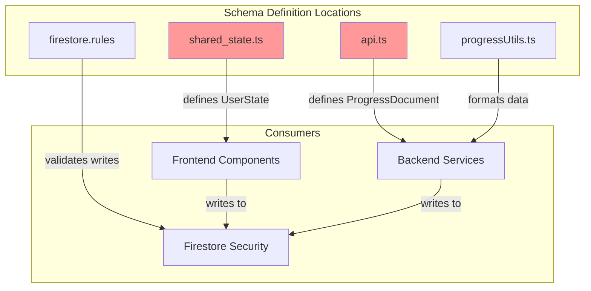

**Change Impact Example:**

Adding a new field `questLine: string` to UserProgressData:

1. **shared_state.ts** - Add to interface + defaultProgressData
2. **api.ts** - Add to ProgressDocument interface
3. **progressUtils.ts** - Add to formatProgress function
4. **firestore.rules** - Add validation rule
5. **Migration** - Add to migrateToGameModeStructure
6. **Tests** - Update all test fixtures

**Risk:** Forgetting one location causes runtime errors or security issues

**Mitigation:** Use shared schema package (see section 5.4)

---

## 7. Prioritized Decoupling Recommendations

### 7.1 High Priority (Complete in Phase 2)

#### 1. Remove Legacy Progress Handler (Effort: 2 days, Impact: HIGH)

**Current State:**

- Legacy handler: 696 LOC in `progress/progressHandler.ts`
- Modern handler: 420 LOC in `handlers/progressHandler.ts` + 330 LOC in `ProgressService.ts`
- Both imported in `index.ts`

**Action Items:**

```bash
# 1. Verify all routes use modern handlers
grep -r "progressHandler\." functions/src/index.ts

# 2. Update any remaining legacy callable functions
# 3. Remove imports from index.ts
# 4. Delete progress/progressHandler.ts
# 5. Update tests to use ProgressService
```

**Risk:** LOW - Modern handlers already in production

---

#### 2. Migrate tarkovdata.ts to Pinia Store (Effort: 3 days, Impact: HIGH)

**Current State:**

- Global mutable refs with late initialization
- Components call `useTarkovData()` which has side effects
- Testing requires mocking global state

**Action Items:**

```typescript
// 1. Create stores/tarkovData.ts
export const useTarkovDataStore = defineStore('tarkovData', () => {
  const { tasks, loading: tasksLoading, error: tasksError } = useTaskData();
  const { hideoutStations, loading: hideoutLoading } = useHideoutData();
  const { maps } = useMapData();

  const loading = computed(() => tasksLoading.value || hideoutLoading.value);
  const error = computed(() => tasksError.value);

  return {
    tasks,
    hideoutStations,
    maps,
    loading,
    error,
  };
});

// 2. Update components to use store
- const { tasks } = useTarkovData();
+ const tarkovData = useTarkovDataStore();
+ const { tasks } = storeToRefs(tarkovData);

// 3. Remove tarkovdata.ts after all components migrated
```

**Risk:** MEDIUM - Requires updating ~20 components

---

#### 3. Create Shared Types Package (Effort: 1 week, Impact: HIGH)

**Current State:**

- Types duplicated in shared_state.ts and api.ts
- No runtime validation
- Schema changes require manual updates in 4+ locations

**Action Items:**

```bash
# 1. Create monorepo package
mkdir -p packages/shared/src/{schemas,types}

# 2. Install zod for runtime validation
cd packages/shared && npm install zod

# 3. Move shared types to package
# 4. Update tsconfig paths in frontend and functions
# 5. Update imports in all files
```

**Benefit:** Single source of truth + runtime validation

---

### 7.2 Medium Priority (Complete in Phase 3)

#### 4. Implement Redis Caching for Game Data (Effort: 4 days, Impact: MEDIUM)

**Current State:**

- No distributed cache
- Each Cloud Function instance caches independently
- Tarkov.dev API queried on every frontend page load

**Action Items:**

```typescript
// 1. Add Redis Cloud (or Memorystore) to Firebase project
// 2. Create cache service

import { createClient } from 'redis';

export class GameDataCache {
  private redis = createClient({ url: process.env.REDIS_URL });

  async getTaskData(): Promise<TaskData | null> {
    const cached = await this.redis.get('tarkov:tasks');
    if (cached) return JSON.parse(cached);

    const data = await fetchFromTarkovAPI();
    await this.redis.setex('tarkov:tasks', 86400, JSON.stringify(data)); // 24h TTL
    return data;
  }
}

// 3. Update dataLoaders.ts to use cache
// 4. Add cache invalidation endpoint for manual refresh
```

**Benefit:** Reduce Tarkov.dev API calls by 90%+

---

#### 5. Refactor TaskAvailabilityService to Use Interfaces (Effort: 3 days, Impact: MEDIUM)

**Current State:**

- Service depends on concrete Pinia store types
- Testing requires full dependency graph
- Tight coupling to progress store structure

**Action Items:**

```typescript
// 1. Define clear interfaces
export interface TaskEvaluationContext {
  getTraderLevel(traderId: string): number;
  getTraderStanding(traderId: string): number;
  getTaskCompletion(taskId: string): boolean;
  getPlayerLevel(): number;
  getPlayerFaction(): string;
}

// 2. Update service constructor
export class TaskAvailabilityService {
  constructor(
    private taskMap: Map<string, Task>,
    private context: TaskEvaluationContext  // INTERFACE
  ) {}
}

// 3. Create adapter in calling code
const context: TaskEvaluationContext = {
  getTraderLevel: (traderId) => traderLevels.value[teamId][traderId] ?? 0,
  getTraderStanding: (traderId) => traderStandings.value[teamId][traderId] ?? 0,
  // ...
};

const service = new TaskAvailabilityService(taskMap, context);
```

**Benefit:** Easier testing, clearer dependencies

---

### 7.3 Low Priority (Complete in Phase 4)

#### 6. Consolidate Callable + HTTP APIs (Effort: 2 weeks, Impact: LOW)

**Current State:**

- Dual implementation: callable functions + HTTP endpoints
- Increases maintenance burden
- CORS handling duplicated

**Action Items:**

```typescript
// Option A: HTTP-only (recommended)
- Remove callable functions (createTeam, joinTeam, leaveTeam)
- Keep only Express routes in api endpoint
- Simpler CORS handling
- Easier to version (/api/v2/)

// Option B: Callable-only
- Remove Express routes
- Use Firebase callable functions exclusively
- Better Firebase integration
- BUT: Harder to version, CORS complexity
```

**Recommendation:** Option A (HTTP-only) for better RESTful API design

---

#### 7. Add GraphQL Schema Validation in CI/CD (Effort: 1 day, Impact: LOW)

**Current State:**

- No validation that Tarkov.dev API schema matches our queries
- Schema changes break frontend silently

**Action Items:**

```bash
# 1. Add graphql-codegen to generate types from schema
npm install -D @graphql-codegen/cli @graphql-codegen/typescript

# 2. Create codegen.yml
schema: https://api.tarkov.dev/graphql
documents: frontend/src/utils/tarkovdataquery.ts
generates:
  frontend/src/types/generated/tarkov-api.ts:
    plugins:
      - typescript
      - typescript-operations

# 3. Add to CI/CD pipeline
npm run codegen  # Fails if schema changed incompatibly
```

**Benefit:** Early detection of API breaking changes

---

## 8. Migration Roadmap Summary

### Phase 1: Security & Dependencies (Weeks 1-2)

✅ Already documented in LEGACY_MODERNIZATION_REPORT.md

### Phase 2: Architectural Decoupling (Weeks 3-5)

| Task | Effort | Impact | Dependencies |
|------|--------|--------|--------------|
| Remove legacy progress handler | 2 days | HIGH | None |
| Migrate tarkovdata.ts to Pinia | 3 days | HIGH | None |
| Create shared types package | 1 week | HIGH | Zod installation |
| **Total Phase 2** | **2.5 weeks** | | |

### Phase 3: Performance & Caching (Weeks 6-8)

| Task | Effort | Impact | Dependencies |
|------|--------|--------|--------------|
| Implement Redis caching | 4 days | MEDIUM | Redis Cloud setup |
| Refactor TaskAvailabilityService | 3 days | MEDIUM | None |
| Add distributed tracing | 2 days | LOW | Firebase Performance |
| **Total Phase 3** | **2 weeks** | | |

### Phase 4: API Consolidation (Weeks 9-10)

| Task | Effort | Impact | Dependencies |
|------|--------|--------|--------------|
| Consolidate callable/HTTP APIs | 2 weeks | LOW | Testing |
| Add GraphQL validation | 1 day | LOW | None |
| **Total Phase 4** | **2 weeks** | | |

---

## 9. Risk Assessment Matrix

| Decoupling Task | Technical Risk | Business Risk | Rollback Difficulty | Priority |
|-----------------|----------------|---------------|---------------------|----------|
| Remove legacy handler | LOW | LOW | EASY | HIGH |
| Migrate tarkovdata.ts | MEDIUM | LOW | MEDIUM | HIGH |
| Create shared types | LOW | LOW | EASY | HIGH |
| Redis caching | MEDIUM | LOW | EASY | MEDIUM |
| Refactor availability service | LOW | LOW | EASY | MEDIUM |
| Consolidate APIs | HIGH | MEDIUM | HARD | LOW |
| GraphQL validation | LOW | LOW | EASY | LOW |

**Risk Mitigation Strategies:**

1. **Feature flags** for new code paths
2. **Blue-green deployment** for backend changes
3. **Incremental rollout** (10% → 50% → 100% traffic)
4. **Monitoring dashboards** (Firestore read/write costs, API latency)
5. **Rollback plan** documented for each phase

---

## 10. Monitoring Integration Points

### Critical Metrics to Track

```typescript
// Recommended monitoring setup
const metrics = {
  // API Performance
  'api/progress/latency': 'Histogram',
  'api/team/latency': 'Histogram',
  'firestore/reads': 'Counter',
  'firestore/writes': 'Counter',

  // Cache Performance (after Redis implementation)
  'cache/hit_rate': 'Gauge',
  'cache/miss_rate': 'Gauge',
  'tarkov_api/calls': 'Counter',

  // Error Rates
  'errors/auth_failures': 'Counter',
  'errors/firestore_errors': 'Counter',
  'errors/tarkov_api_failures': 'Counter',

  // Business Metrics
  'team/creations': 'Counter',
  'tasks/completions': 'Counter',
  'api_tokens/created': 'Counter',
};
```

**Integration Points:**

1. **Firebase Performance Monitoring** - Automatic trace collection
2. **Cloud Functions Metrics** - Built-in latency/error tracking
3. **Custom Logging** - Structured logs for error analysis
4. **Firestore Usage Dashboard** - Monitor read/write costs

---

## Appendix A: Facade Pattern Examples

### Example 1: Progress Update Facade

```typescript
// frontend/src/facades/ProgressFacade.ts
export class ProgressFacade {
  private apiClient = useApiClient();

  /**
   * Facade for task updates - always goes through backend
   */
  async updateTask(taskId: string, state: 'completed' | 'failed' | 'uncompleted') {
    try {
      await this.apiClient.post(`/api/progress/task/${taskId}`, {
        state,
        gameMode: getCurrentGameMode(), // Inject current game mode
      });

      // VueFire will automatically update the store via real-time listener
      // No need to manually update local state
    } catch (error) {
      console.error('Failed to update task:', error);
      throw new ProgressUpdateError('Task update failed', { taskId, state });
    }
  }

  /**
   * Facade for objective updates with count tracking
   */
  async updateObjective(objectiveId: string, updates: { count?: number; complete?: boolean }) {
    const payload = updates.complete !== undefined
      ? { state: updates.complete ? 'completed' : 'uncompleted' }
      : { count: updates.count };

    await this.apiClient.post(`/api/progress/task/objective/${objectiveId}`, payload);
  }
}
```

### Example 2: Team Data Facade

```typescript
// frontend/src/facades/TeamFacade.ts
export class TeamFacade {
  /**
   * Facade for team operations - handles auth + error translation
   */
  async createTeam(password?: string, maxMembers?: number) {
    const token = await getCurrentUserIdToken();

    try {
      const response = await fetch('/api/team/create', {
        method: 'POST',
        headers: {
          'Authorization': `Bearer ${token}`,
          'Content-Type': 'application/json',
        },
        body: JSON.stringify({
          password,
          maximumMembers: maxMembers || 10,
        }),
      });

      if (!response.ok) {
        const error = await response.json();
        throw new TeamError(error.message || 'Failed to create team');
      }

      return await response.json();
    } catch (error) {
      if (error instanceof TeamError) throw error;
      throw new TeamError('Network error creating team');
    }
  }
}
```

---

## Appendix B: Adapter Pattern Examples

### Example 1: Legacy API Adapter

```typescript
// backend/adapters/LegacyApiAdapter.ts
export class LegacyApiAdapter {
  private progressService = new ProgressService();

  /**
   * Adapts legacy updateTask signature to modern ProgressService
   */
  async updateTask(taskId: string, complete: boolean, userId: string) {
    this.logDeprecation('updateTask');

    const state = complete ? 'completed' : 'uncompleted';
    return await this.progressService.updateSingleTask(
      userId,
      taskId,
      state,
      'pvp' // Default to PvP for legacy calls
    );
  }

  /**
   * Adapts legacy getProgress signature to modern format
   */
  async getProgress(userId: string, gamemode?: string) {
    this.logDeprecation('getProgress');

    return await this.progressService.getUserProgress(
      userId,
      gamemode || 'pvp'
    );
  }

  private logDeprecation(method: string) {
    logger.warn(`Legacy API method ${method} called`, {
      method,
      timestamp: Date.now(),
      recommendation: 'Migrate to ProgressService',
    });
  }
}
```

### Example 2: Schema Version Adapter

```typescript
// shared/adapters/SchemaVersionAdapter.ts
export class SchemaVersionAdapter {
  /**
   * Adapts legacy progress format to gamemode-aware format
   */
  static toLegacy(modernData: UserState): LegacyProgressDocument {
    const currentData = modernData[modernData.currentGameMode];

    return {
      level: currentData.level,
      displayName: currentData.displayName,
      gameEdition: modernData.gameEdition,
      pmcFaction: currentData.pmcFaction,
      taskCompletions: currentData.taskCompletions,
      taskObjectives: currentData.taskObjectives,
      hideoutModules: currentData.hideoutModules,
      hideoutParts: currentData.hideoutParts,
    };
  }

  /**
   * Adapts legacy format to modern gamemode-aware format
   */
  static fromLegacy(legacyData: LegacyProgressDocument): UserState {
    return migrateToGameModeStructure(legacyData);
  }
}
```

---

## Conclusion

This dependency and integration analysis reveals a moderately coupled architecture with clear modernization paths. The primary coupling hotspots are:

1. **tarkovdata.ts global state pattern** (HIGH PRIORITY)
2. **Shared schema across frontend/backend** (HIGH PRIORITY)
3. **Legacy handler implementations** (HIGH PRIORITY)
4. **No distributed caching layer** (MEDIUM PRIORITY)

The recommended facade/adapter patterns provide clean migration paths while maintaining backward compatibility. Following the phased roadmap will reduce coupling from **HIGH** to **LOW** over 10 weeks with manageable risk.

**Next Steps:**

1. Review this analysis with team
2. Create GitHub issues for Phase 2 tasks
3. Set up monitoring dashboards before starting migrations
4. Begin Phase 2 with legacy handler removal

---

**Document Version:** 1.0
**Last Updated:** 2025-10-14
**Maintainer:** Claude Code (Sonnet 4.5)
