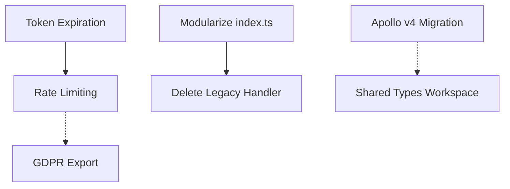

# TarkovTracker - Current Action Items

**Last Updated:** 2025-10-15
**Status:** Active Development
**Next Review:** After completing P0 items

---

## Overview

This document tracks **currently outstanding** work items for the TarkovTracker project. Historical items and completed work have been archived to `REPORTS/archive/`.

**Recent Achievements (Completed since October 14):**

- ✅ TaskList.vue decomposed: 1,168 → 127 lines (-89%)
- ✅ progress.ts store optimized: 619 → 200 lines (-68%)
- ✅ Firebase modular imports: 100% migrated
- ✅ Task filtering: Fully implemented with EOD support
- ✅ Legacy progress handler removed

---

## Priority 0: Critical (Do Next)

### 1. Implement Token Inactivity-Based Expiration

**Status:** ❌ Not Started
**Priority:** P0
**Effort:** 6-8 hours
**Risk:** LOW - Well-defined implementation

**Policy:** All API tokens automatically expire after 180 days of inactivity.

**Implementation Guide:** See [`TOKEN_INACTIVITY_EXPIRATION_GUIDE.md`](./TOKEN_INACTIVITY_EXPIRATION_GUIDE.md) for complete implementation details.

**Summary:**

- Add `lastUsed` and `revoked` fields to ApiToken interface
- Update middleware to check inactivity and auto-revoke expired tokens
- Update `lastUsed` timestamp on each API call
- Add regeneration endpoint for expired tokens
- Update frontend UI to display expiration warnings and status

**Key Benefits:**

- ✅ Active integrations never break (calls reset the timer)
- ✅ Abandoned tokens automatically cleanup
- ✅ Simple, predictable "use it or lose it" behavior
- ✅ Industry standard approach (GitHub, AWS, Google Cloud)

---

### 2. Modularize functions/src/index.ts

**Status:** ❌ Not Started
**Priority:** P0
**Effort:** 2-3 days
**Risk:** MEDIUM - Maintainability issue

**Current State:**

- `functions/src/index.ts` is 917 lines (verified 2025-10-15)
- Mixes Express setup, team logic, callable exports, scheduled jobs
- Difficult to test individual functions
- Hard for new developers to navigate

**Target Structure:**

```bash
functions/src/
├── index.ts                    # < 150 lines (orchestration only)
├── api/
│   └── app.ts                 # Express app setup
├── callables/
│   ├── team.ts                # Team callable functions
│   ├── token.ts               # Token callable functions
│   └── progress.ts            # Progress callables (if needed)
├── scheduled/
│   └── tarkovData.ts          # Scheduled data sync
└── routes/
    ├── progress.ts            # Progress routes
    ├── team.ts                # Team routes
    └── token.ts               # Token routes
```

**Migration Steps:**

1. Extract team callables → `callables/team.ts` (lines 207-480 of index.ts)
2. Extract scheduled job → `scheduled/tarkovData.ts` (lines 749-913)
3. Extract Express setup → `api/app.ts` (lines 38-161)
4. Update exports in index.ts to reference new modules
5. Update tests to import from new locations

**Acceptance Criteria:**

- index.ts < 200 lines
- All tests passing
- No functional changes to API behavior

---

## Priority 1: High (Next Sprint)

---

### 3. Apollo Client v3 → v4 Migration

**Status:** ❌ Not Started
**Priority:** P1
**Effort:** 6-8 hours
**Risk:** MEDIUM - Breaking changes, but well-documented

**Implementation Guide:** See [`APOLLO_CLIENT_V4_UPGRADE_GUIDE.md`](./APOLLO_CLIENT_V4_UPGRADE_GUIDE.md) for complete migration steps.

**Summary:**

- Install RxJS peer dependency (`rxjs@^7.8.1`)
- Update Apollo Client to v4.0.7
- Change `createHttpLink()` → `new HttpLink()`
- Update custom fetch function for timeout handling
- Run comprehensive test suite

**Benefits:**

- 10-15% smaller bundle size
- Better TypeScript support
- Modern RxJS-based observables
- Improved performance and error handling

**Current State:** `@apollo/client: ^3.14.0` using Vue Apollo Composable v4 (already compatible)

---

### 4. Harden CORS Configuration

**Status:** ❌ Not Started
**Priority:** P1
**Effort:** 4 hours
**Risk:** LOW - Security hardening

**Current State:**

```typescript
// functions/src/index.ts:38-63
app.use(cors({
  origin: true,  // Reflects any origin with credentials
  credentials: true,
}));
```

**Issue:** `origin: true` allows any origin to make authenticated requests

**Required Changes:**

```typescript
// Production allowlist
const allowedOrigins = [
  'https://tarkovtracker.io',
  'https://www.tarkovtracker.io',
  'https://tarkovtracker-staging.web.app',  // Staging
];

// Development fallback
const isDevelopment = process.env.NODE_ENV !== 'production';

app.use(cors({
  origin: (origin, callback) => {
    if (isDevelopment) {
      callback(null, true);  // Allow all in dev
    } else if (!origin || allowedOrigins.includes(origin)) {
      callback(null, true);
    } else {
      callback(new Error('Not allowed by CORS'));
    }
  },
  credentials: true,
}));
```

**Testing:**

- Verify requests from tarkovtracker.io succeed
- Verify requests from unauthorized domains fail
- Test staging environment separately

---

## Priority 2: Medium (Backlog)

### 5. Evaluate API Rate Limiting Strategy

**Status:** ❌ Not Started
**Priority:** P2
**Effort:** 1 day

**Current State:**

- `abuseGuard` middleware now enforces sliding-window throttling with warn/block events
- Counters live in-memory (`Map`) → no coordination across Cloud Functions instances
- Event logs persist to Firestore but do not gate incoming requests
- No documented product decision on desired per-token vs per-IP quotas

**Next Steps:**

1. Confirm desired limits (token/IP, window size, enforcement path) with product/security.
2. Implement shared storage for counters (e.g., Firestore aggregation, Redis, Cloud Tasks) so limits survive instance rotation.
3. Update `abuseGuard` (or replace with managed solution) to read/write shared counters and ensure consistent blocking.
4. Keep existing instrumentation for telemetry; extend dashboards/alerts once limits are enforced cluster-wide.

**Testing:**

- Simulate burst traffic across multiple cold starts (deploy two instances locally or via load test)
- Verify persistence of throttle counts after instance restart
- Ensure Firestore write volume stays within quota (batch writes or TTL cleanup as needed)

---

### 6. Create Shared Types Workspace

**Status:** ❌ Not Started
**Priority:** P2
**Effort:** 1 week

**Current State:**

- Types duplicated in `frontend/src/shared_state.ts` and `functions/src/types/api.ts`
- Schema changes require manual updates in 4+ locations
- No runtime validation

**Target Structure:**

```bash
packages/
└── shared/
    ├── package.json
    ├── src/
    │   ├── schemas/
    │   │   ├── progress.ts  (Zod schemas)
    │   │   ├── team.ts
    │   │   └── token.ts
    │   └── types/
    │       └── index.ts
    └── tsconfig.json
```

**Benefits:**

- Single source of truth
- Runtime validation with Zod
- Easier schema versioning

---

### 7. Add Firestore Indexes

**Status:** ❌ Not Started
**Priority:** P2
**Effort:** 2 hours

**Current State:**

- `firestore.indexes.json` is empty
- Complex queries may be slow at scale

**Required Indexes:**

```json
{
  "indexes": [
    {
      "collectionGroup": "team",
      "queryScope": "COLLECTION",
      "fields": [
        { "fieldPath": "owner", "order": "ASCENDING" },
        { "fieldPath": "createdAt", "order": "DESCENDING" }
      ]
    },
    {
      "collectionGroup": "token",
      "queryScope": "COLLECTION",
      "fields": [
        { "fieldPath": "owner", "order": "ASCENDING" },
        { "fieldPath": "createdAt", "order": "DESCENDING" }
      ]
    }
  ]
}
```

---

### 8. Implement Data Export Endpoint (GDPR)

**Status:** ❌ Not Started
**Priority:** P2
**Effort:** 1 day

**Requirement:** GDPR right to data portability

**Implementation:**

```typescript
export const exportUserData = onCall({ memory: '256MiB' }, async (request) => {
  const userId = request.auth.uid;

  const [progress, system, tokens] = await Promise.all([
    db.collection('progress').doc(userId).get(),
    db.collection('system').doc(userId).get(),
    db.collection('token').where('owner', '==', userId).get(),
  ]);

  return {
    progress: progress.data(),
    system: system.data(),
    tokens: tokens.docs.map(doc => doc.data()),
    exportedAt: new Date().toISOString(),
    format: 'JSON',
  };
});
```

---

## Completed Items (Archive)

For historical context, see:

- `REPORTS/archive/2025-10-15/COMPREHENSIVE_REVIEW_REPORT.md`
- `REPORTS/archive/2025-10-15/PERFORMANCE_OPTIMIZATION_REPORT.md`

**Recent Completions:**

- ✅ Component decomposition (TaskList.vue, progress.ts)
- ✅ Firebase modular imports migration
- ✅ Task filtering with EOD support
- ✅ Kill tracker for shooting objectives
- ✅ Dashboard alert enhancements

---

## Tracking Progress

**How to Use This Document:**

1. **Before starting work** - Check P0 items first
2. **During work** - Update status from ❌ to ⚠️ (in progress) to ✅ (done)
3. **After completion** - Move item to "Completed Items" section
4. **Weekly review** - Re-prioritize P1/P2 items based on impact

**Status Indicators:**

- ❌ Not Started
- ⚠️ In Progress
- ✅ Complete
- 🔄 Blocked (with reason)

---

## Dependencies Between Items



**Legend:**

- Solid arrow: Must complete first
- Dotted arrow: Related but not blocking

---

## Next Review Date

**Scheduled:** After completing both P0 items (Token Expiration + index.ts modularization)

**Agenda:**

1. Re-prioritize P1 items
2. Assess if any P2 items should be promoted
3. Update line counts and verify no regressions
4. Check for new technical debt

---

**Document Version:** 1.0
**Maintainer:** Development Team
**Last Verified Against Codebase:** 2025-10-15
