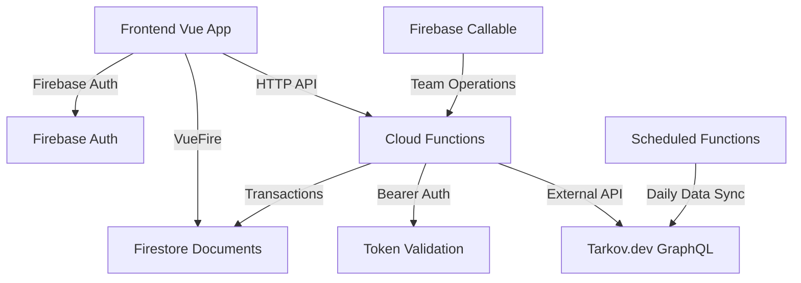

# TarkovTracker Backend Functions

A Firebase Cloud Functions backend providing secure API access for the TarkovTracker application. Built with Express.js, TypeScript, and Firestore with comprehensive API documentation via OpenAPI/Swagger.

## 🏗️ Architecture Overview

The backend follows a clean service-oriented architecture with clear separation of concerns:

```bash
src/
├── handlers/           # Express route handlers (thin layer)
│   ├── progressHandler.ts    # Player progress operations
│   ├── teamHandler.ts        # Team management endpoints  
│   └── tokenHandler.ts       # API token information
├── services/          # Business logic services
│   ├── ProgressService.ts    # User progress CRUD operations
│   ├── TeamService.ts        # Team creation/management
│   ├── TokenService.ts       # API token lifecycle
│   └── ValidationService.ts  # Input validation & sanitization
├── middleware/        # Authentication & error handling
│   ├── auth.ts              # Bearer token middleware
│   └── errorHandler.ts      # Centralized error handling
├── types/            # Shared TypeScript interfaces
│   └── api.ts               # API types and interfaces
├── utils/            # Utilities and helpers
│   └── dataLoaders.ts       # Cached Firestore data loading
├── openapi/          # API documentation generation
│   ├── swagger.ts           # OpenAPI spec generation
│   └── components.ts        # OpenAPI schema definitions
├── auth/             # Legacy authentication (backward compatibility)
├── progress/         # Legacy progress handlers (backward compatibility)  
├── token/            # Legacy token handlers (backward compatibility)
├── deploy-config.ts  # Feature flags and deployment config
└── index.ts          # Main entry point and routing
```

## 🚀 Quick Start

### Prerequisites

- **Node.js 22+** (specified in `package.json`)
- **Java JRE 11+** (for Firebase Emulator Suite)
- **Firebase CLI** (`npm install -g firebase-tools`)

### Development Setup

1. **Install dependencies:**

   ```bash
   cd functions
   npm install
   ```

2. **Start development environment:**

   ```bash
   # From project root
   npm run dev
   # OR run functions emulator only
   npm run emulators
   ```

3. **Build and test:**

   ```bash
   npm run build        # Compile TypeScript
   npm run lint         # Code linting
   npm run test         # Run test suite
   ```

### Production Deployment

```bash
npm run deploy:prod     # Deploy to production
npm run deploy:staging  # Deploy to staging preview channel
```

## 📡 API Endpoints

### Authentication

All API endpoints require Bearer token authentication via the `Authorization` header:

```md
Authorization: Bearer <your-api-token>
```

### Core Endpoints

#### **Progress Management**

- `GET /api/progress` - Get player progress data
- `POST /api/progress/level/:levelValue` - Set player level
- `POST /api/progress/task/:taskId` - Update single task status
- `POST /api/progress/tasks` - Update multiple tasks (batch)
- `POST /api/progress/task/objective/:objectiveId` - Update task objective

#### **Team Management**  

- `GET /api/team/progress` - Get team members' progress
- `POST /api/team/create` - Create new team
- `POST /api/team/join` - Join existing team
- `POST /api/team/leave` - Leave current team

#### **Token Information**

- `GET /api/token` - Get current API token details

#### **System Health**

- `GET /health` - Health check endpoint with feature flags

### Backward Compatibility

All endpoints are available under both `/api/` and `/api/v2/` for legacy support.

## 🔐 Authentication & Security

### API Token System

- **Token Generation**: Cryptographically secure 64-character tokens
- **Permissions**: Granular permissions (`GP` = Get Progress, `TP` = Team Progress, `WP` = Write Progress)
- **Call Tracking**: Automatic usage analytics per token
- **Owner Validation**: Users can only manage their own tokens

### Security Features

- **Input Validation**: Comprehensive type-safe validation
- **SQL Injection Protection**: Parameterized Firestore queries
- **XSS Prevention**: Input sanitization and output encoding
- **Rate Limiting**: Token-based call tracking (extensible to rate limits)
- **Error Handling**: Secure error messages without internal details

### Transaction Safety

All multi-document operations use Firestore transactions to ensure data consistency:

```typescript
// Example: Atomic team creation
await this.db.runTransaction(async (transaction) => {
  // Validate user state
  const systemDoc = await transaction.get(systemRef);
  
  // Create team and update user atomically
  transaction.set(teamRef, teamData);
  transaction.set(systemRef, { team: teamId });
});
```

## 📚 OpenAPI Documentation

### Generating Documentation

```bash
npm run swagger   # Generate OpenAPI spec
npm run docs      # Build functions + generate docs
npm run docs:serve # Generate docs + serve instructions
```

### API Documentation Structure

**Generated Files:**

- `/docs/openapi.json` - OpenAPI 3.0 specification
- `/docs/openapi.js` - Browser-ready JavaScript export

**Documentation Features:**

- **Interactive API Explorer**: Full Swagger UI integration
- **Schema Validation**: Request/response type checking
- **Authentication Examples**: Bearer token usage patterns
- **Error Response Codes**: Comprehensive HTTP status documentation

### OpenAPI Configuration

```typescript
// swagger.ts configuration
const swaggerOptions = {
  definition: {
    openapi: '3.0.0',
    info: {
      title: 'TarkovTracker API (Fork)',
      version: '2.0',
      description: "Player's progress, objectives, level, reputation and more."
    },
    servers: [
      { url: 'https://tarkovtracker.org/api/v2', description: 'Production' },
      { url: 'https://staging--tarkovtracker-org.web.app/api/v2', description: 'Staging preview channel' }
    ]
  },
  apis: ['lib/**/*.js'] // Generated JS files with JSDoc comments
};
```

## 🔄 Frontend Integration

### Real-time Data Sync

The backend integrates seamlessly with the Vue 3 frontend through:

**Firebase Integration:**

- **VueFire Plugin**: Real-time Firestore document sync
- **Authentication State**: Shared Firebase Auth context
- **Offline Support**: Client-side caching with automatic sync

**API Integration:**

- **Bearer Tokens**: Generated via Firebase callable functions
- **Progress Updates**: RESTful API for external integrations
- **Team Features**: Real-time team member progress updates

### Data Flow Architecture



### Frontend Code Integration

**Store Integration (Pinia):**

```typescript
// Frontend store accessing backend API
export const useProgressStore = defineStore('progress', () => {
  const progress = ref<FormattedProgress | null>(null);
  
  // Real-time sync via VueFire
  const { data: firestoreProgress } = useDocument(
    doc(db, 'progress', userId)
  );
  
  // API calls for updates
  const updateTask = async (taskId: string, state: TaskStatus) => {
    await $fetch(`/api/progress/task/${taskId}`, {
      method: 'POST',
      headers: { Authorization: `Bearer ${token}` },
      body: { state }
    });
  };
});
```

**Component Usage:**

```vue
<template>
  <div>
    <TaskProgress 
      :tasks="progress?.tasksProgress" 
      @update="handleTaskUpdate"
    />
  </div>
</template>

<script setup lang="ts">
const { progress, updateTask } = useProgressStore();

const handleTaskUpdate = async (taskId: string, completed: boolean) => {
  await updateTask(taskId, completed ? 'completed' : 'uncompleted');
};
</script>
```

## 🗄️ Database Schema

### Firestore Collections

#### **`/progress/{userId}`**

```typescript
interface ProgressDocument {
  level?: number;
  displayName?: string;
  gameEdition?: number;
  pmcFaction?: 'USEC' | 'BEAR';
  taskCompletions?: Record<string, TaskCompletion>;
  taskObjectives?: Record<string, TaskObjective>;
  hideoutModules?: Record<string, HideoutModule>;
  hideoutParts?: Record<string, HideoutPart>;
}
```

#### **`/team/{teamId}`**

```typescript
interface TeamDocument {
  owner: string;
  password: string;
  maximumMembers: number;
  members: string[];
  createdAt: Timestamp;
}
```

#### **`/system/{userId}`**

```typescript
interface SystemDocument {
  team?: string | null;
  teamMax?: number;
  lastLeftTeam?: Timestamp;
}
```

#### **`/token/{tokenString}`**

```typescript
interface TokenDocument {
  owner: string;
  note: string;
  permissions: string[];
  calls?: number;
  createdAt?: Timestamp;
}
```

#### **`/tarkovdata/{dataType}`**

- `tasks` - Task definitions from Tarkov.dev API
- `hideout` - Hideout module data
- Cached external API data with in-memory loading

## 🔧 Configuration & Deployment

### Environment Configuration

**Feature Flags (`deploy-config.ts`):**

```typescript
interface DeploymentConfig {
  useNewErrorHandling: boolean;
  useNewProgressService: boolean; 
  useNewTeamService: boolean;
  useNewTokenService: boolean;
  enableDetailedLogging: boolean;
  enablePerformanceMonitoring: boolean;
  rollbackOnErrorRate: number;
  rollbackOnResponseTime: number;
}
```

**Production Config:**

```typescript
export const PRODUCTION_CONFIG: DeploymentConfig = {
  useNewErrorHandling: true,
  useNewProgressService: true,
  useNewTeamService: true,
  useNewTokenService: true,
  enableDetailedLogging: false,        // Security
  enablePerformanceMonitoring: true,   // Observability
  rollbackOnErrorRate: 5,              // 5% error rate threshold
  rollbackOnResponseTime: 5000,        // 5s response time threshold
};
```

### Deployment Commands

```bash
# Production deployment
npm run deploy:prod

# Staging preview deployment
npm run deploy:staging

# Functions only
firebase deploy --only functions

# With environment variables
firebase functions:config:set api.key="value"
```

### Monitoring & Health Checks

**Health Endpoint (`GET /health`):**

```json
{
  "success": true,
  "data": {
    "status": "healthy",
    "timestamp": "2024-01-15T10:30:00.000Z",
    "version": "2.0.0",
    "service": "tarkovtracker-api",
    "features": {
      "newErrorHandling": true,
      "newProgressService": true,
      "newTeamService": true,
      "newTokenService": true
    }
  }
}
```

## 📈 Performance & Optimization

### Database Optimization

- **Transaction Batching**: Multiple operations in single transactions
- **Query Optimization**: Proper indexing on frequently queried fields
- **Caching**: In-memory caching for Tarkov.dev API data
- **Connection Pooling**: Efficient Firestore connection management

### API Performance

- **Async Operations**: Non-blocking token call counter updates
- **Error Fast-Fail**: Quick validation to prevent unnecessary processing
- **Logging Efficiency**: Structured logging with appropriate log levels
- **Response Streaming**: Efficient JSON serialization

### Scheduled Operations

```typescript
// Daily Tarkov.dev data sync
export const scheduledTarkovDataFetch = onSchedule('every day 00:00', async () => {
  const data = await retrieveTarkovdata();
  await saveTarkovData(data);
});
```

## 🧪 Testing Strategy

### Test Structure

```bash
test/
├── __mocks__/           # Firebase mocks
├── setup.js             # Test environment setup
├── apiv2.test.js        # API endpoint tests
├── team-consolidated.test.js    # Team operations
├── token-consolidated.test.js   # Token management
└── coverage.test.js     # Code coverage tests
```

### Running Tests

```bash
npm run test          # Run full test suite
npm run test:watch    # Watch mode for development
npm run test:coverage # Generate coverage reports
```

### Test Coverage Areas

- **Unit Tests**: Service layer business logic
- **Integration Tests**: API endpoint behavior
- **Transaction Tests**: Database consistency
- **Authentication Tests**: Token validation flows
- **Error Handling Tests**: Edge cases and failures

## 🚨 Error Handling

### Centralized Error Management

```typescript
// Consistent API error responses
interface ApiResponse<T = unknown> {
  success: boolean;
  data?: T;
  error?: string;
  meta?: {
    code: string;
    timestamp: string;
    // Debug info in development only
  };
}
```

### Error Categories

- **400 Bad Request**: Invalid input parameters
- **401 Unauthorized**: Missing or invalid authentication
- **403 Forbidden**: Insufficient permissions
- **404 Not Found**: Resource not found
- **409 Conflict**: Resource conflict (e.g., already in team)
- **422 Unprocessable Entity**: Valid format but invalid data
- **500 Internal Server Error**: Unexpected server errors
- **503 Service Unavailable**: External service failures

### Production Error Security

- **No Stack Traces**: Sensitive information filtered in production
- **Sanitized Messages**: User-friendly error descriptions
- **Detailed Logging**: Internal logging for debugging
- **Error Correlation**: Request IDs for error tracking

## 🔮 Future Enhancements

### Planned Features

- **Rate Limiting**: Token-based request throttling
- **Caching Layer**: Redis integration for frequently accessed data  
- **Metrics Collection**: Prometheus/Grafana integration
- **WebSocket Support**: Real-time notifications
- **API Versioning**: v3 endpoint planning

### Architecture Improvements

- **Microservices**: Service decomposition for scalability
- **Event Sourcing**: Audit trail and data replay capabilities
- **CQRS Pattern**: Command/Query responsibility separation
- **Circuit Breaker**: External API failure resilience

## 📖 Additional Resources

### Documentation

- **API Documentation**: Generated OpenAPI specs in `/docs`
- **Code Comments**: Comprehensive JSDoc throughout codebase
- **Architecture Decisions**: See `REFACTORING-SUMMARY.md`

### External APIs

- **Tarkov.dev GraphQL**: <https://api.tarkov.dev/graphql>
- **Firebase Documentation**: <https://firebase.google.com/docs>
- **Express.js Guide**: <https://expressjs.com/>

### Development Tools

- **Firebase Emulator Suite**: Local development environment
- **TypeScript**: Static type checking and IntelliSense
- **ESLint + Prettier**: Code quality and formatting
- **Swagger UI**: Interactive API documentation

---

**Note**: This backend maintains 100% backward compatibility with existing frontend integrations while providing a modern, scalable foundation for future development.
